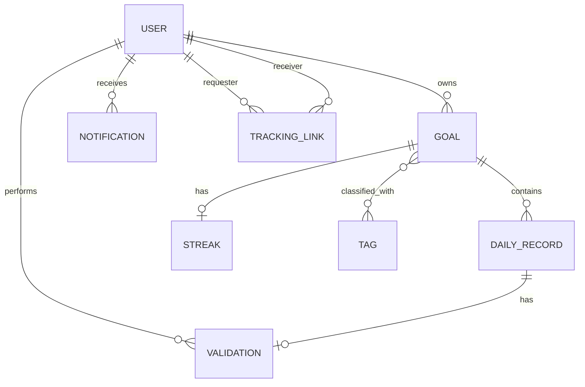
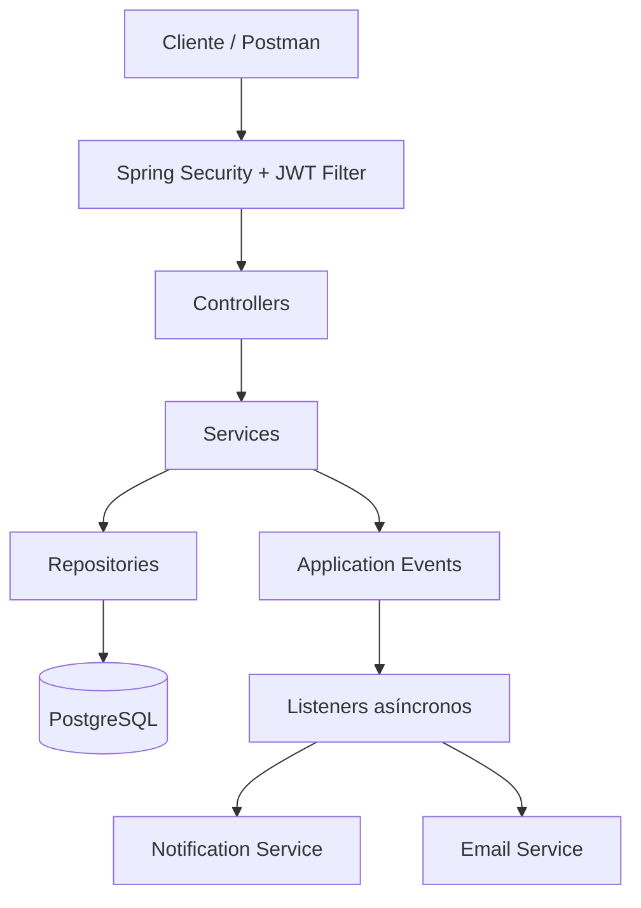
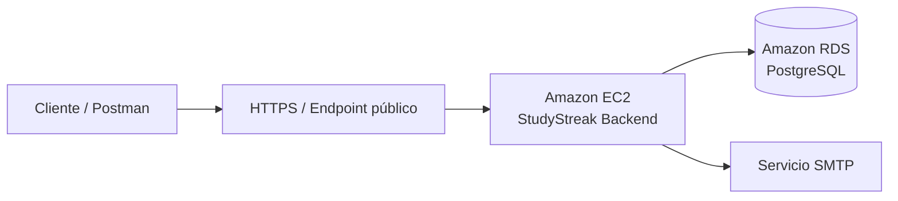

# StudyStreak — Seguimiento colaborativo de hábitos de estudio

Backend desarrollado para el curso **CS 2031 – Desarrollo Basado en Plataforma**.

## Portada

**Título del proyecto:** StudyStreak — Seguimiento colaborativo de hábitos de estudio  
**Curso:** CS 2031 Desarrollo Basado en Plataforma

**Integrantes:**

- [Jared Eloy Daniel Chala Lastra](mailto:jared.chala@utec.edu.pe) — **202520040**
- [Leonard Alexander Landeo Huatay](mailto:leonardo.landeo@utec.edu.pe) — **202520151**
- [Fabricio Nick Tumialan Maihua](mailto:fabricio.tumialan@utec.edu.pe) — **202520045**

**Backend desplegado:** `[AWS_BACKEND_URL]`

> Antes del merge final, verificar rutas, formato definitivo de errores y cambios finales de seguridad contra `main`.

---

## Índice

1. [Introducción](#introducción)
2. [Identificación del problema o necesidad](#identificación-del-problema-o-necesidad)
3. [Descripción de la solución](#descripción-de-la-solución)
4. [Tecnologías utilizadas](#tecnologías-utilizadas)
5. [Modelo de entidades](#modelo-de-entidades)
6. [Manejo de errores](#manejo-de-errores)
7. [Medidas de seguridad implementadas](#medidas-de-seguridad-implementadas)
8. [Eventos y asincronía](#eventos-y-asincronía)
9. [Endpoints principales](#endpoints-principales)
10. [Ejecución local](#ejecución-local)
11. [Docker y PostgreSQL](#docker-y-postgresql)
12. [Despliegue en AWS](#despliegue-en-aws)
13. [GitHub & Management](#github--management)
14. [Conclusión](#conclusión)
15. [Apéndices](#apéndices)

---

## Introducción

### Contexto

StudyStreak es una aplicación backend orientada a ayudar a estudiantes a mantener hábitos de estudio constantes. El sistema combina metas personales, registro de progreso diario, seguimiento entre usuarios, validación de actividades, cálculo de rachas, notificaciones y autenticación segura dentro de una API REST.

El proyecto fue desarrollado como parte del curso **CS 2031 – Desarrollo Basado en Plataforma**. El backend utiliza Spring Boot y PostgreSQL, sigue una arquitectura por capas y emplea Spring Security con JWT. También utiliza eventos de aplicación y procesamiento asíncrono para desacoplar tareas secundarias del flujo principal.

### Objetivos del proyecto

El objetivo general es desarrollar un backend seguro y estructurado para gestionar metas de estudio, registrar progreso, validar actividades y mantener seguimiento entre usuarios.

Objetivos específicos:

- permitir registro, login y autenticación con JWT;
- proteger contraseñas con BCrypt;
- crear metas, registros diarios y tags;
- gestionar relaciones de seguimiento y validaciones;
- calcular rachas y generar notificaciones;
- integrar correo y procesamiento asíncrono;
- persistir datos en PostgreSQL;
- facilitar ejecución con Docker y despliegue en AWS.

---

## Identificación del problema o necesidad

### Descripción del problema

Muchos estudiantes establecen metas académicas, pero tienen dificultades para mantener constancia. El progreso suele registrarse de forma informal y no siempre existe una forma clara de visualizar continuidad, comprobar avances o compartir responsabilidad con otra persona.

StudyStreak busca resolver este problema permitiendo crear metas, registrar actividad diaria y establecer relaciones de seguimiento. Los registros pueden ser validados y, a partir de ellos, se calcula una racha que representa la continuidad del hábito.

### Justificación

Resolver este problema es relevante porque la constancia es un componente importante de los hábitos de estudio. StudyStreak convierte el progreso diario en información estructurada y verificable y agrega un componente de responsabilidad compartida.

Además, el proyecto permite aplicar conceptos del curso como persistencia, DTOs, APIs REST, seguridad, eventos, Docker y despliegue en la nube.

---

## Descripción de la solución

StudyStreak expone una API REST desarrollada con Spring Boot. Los clientes se autentican con JWT y acceden a recursos protegidos mediante Bearer Token.

```text
Registro
   ↓
Login y JWT
   ↓
Goal
   ↓
DailyRecord
   ↓
TrackingLink
   ↓
Validation
   ↓
Streak
   ↓
Notifications
```

Los controllers delegan en services, donde se aplican reglas de negocio, ownership y transacciones. Los repositories gestionan PostgreSQL mediante Spring Data JPA y los DTOs separan la API de las entidades persistentes.

### Funcionalidades implementadas

- **Usuarios y autenticación:** registro, login y acceso con JWT.
- **Goals:** administración de metas.
- **DailyRecords:** progreso diario sin duplicados por meta y fecha.
- **Tags:** clasificación de metas.
- **TrackingLinks:** seguimiento entre usuarios con estados `PENDING`, `ACCEPTED` y `REJECTED`.
- **Validations:** aprobación de registros por usuarios autorizados.
- **Streaks:** cálculo de racha actual y mejor racha.
- **Notifications:** avisos asociados a eventos relevantes.

---

## Tecnologías utilizadas

- Java 21
- Spring Boot y Spring Web
- Spring Data JPA / Hibernate
- Spring Security
- JJWT
- Jakarta Bean Validation
- PostgreSQL 17
- ModelMapper
- Lombok
- Spring Mail / JavaMailSender
- servicio SMTP externo
- Maven
- Docker y Docker Compose
- AWS EC2
- Amazon RDS for PostgreSQL
- Git y GitHub

---

## Modelo de entidades

Las entidades principales son **User, Goal, DailyRecord, Tag, TrackingLink, Validation, Streak** y **Notification**.

### Diagrama Entidad-Relación



### Descripción de entidades

| Entidad | Atributos principales | Relaciones |
|---|---|---|
| `User` | `id`, `username`, `email`, `password`, `active`, `timeZone`, `role` | Posee Goals, recibe Notifications y participa en TrackingLinks y Validations |
| `Goal` | `id`, `topic`, `frequency`, `duration`, `completed` | Pertenece a User, contiene DailyRecords, se relaciona con Tags y puede tener Streak |
| `DailyRecord` | `id`, `date`, `note`, `evidence` | Pertenece a Goal y puede tener Validation |
| `Tag` | `id`, `name` | Relación muchos a muchos con Goal |
| `TrackingLink` | `id`, `status` | Relaciona requester y receiver |
| `Validation` | `id`, `approved`, `comment` | Pertenece a DailyRecord y es realizada por User |
| `Streak` | `id`, `currentStreak`, `bestStreak`, `lastUpdateDate` | Pertenece a Goal |
| `Notification` | `id`, `message`, `read`, `createdAt`, `type` | Pertenece a User |

`Goal` puede existir sin `Streak`, pero como máximo tiene uno. `DailyRecord` puede tener cero o una `Validation`.

### Arquitectura general



---

## Manejo de errores

El backend centraliza excepciones mediante `@RestControllerAdvice`, manteniendo códigos HTTP consistentes entre controllers.

- `400 Bad Request`: request inválido o mal formado.
- `401 Unauthorized`: fallo de autenticación.
- `403 Forbidden`: usuario sin permisos sobre el recurso.
- `404 Not Found`: recurso inexistente.
- `409 Conflict`: conflicto con el estado actual.
- `500 Internal Server Error`: fallo inesperado.

Entre las excepciones del dominio se encuentran `ResourceNotFoundException`, `ConflictException` y `ForbiddenException`. El manejo global evita exponer detalles internos y unifica las respuestas.

<!-- SINCRONIZACIÓN FINAL: verificar el formato definitivo del ErrorResponseDTO. -->

---

## Medidas de seguridad implementadas

### Seguridad de datos

Las contraseñas se codifican con `BCryptPasswordEncoder`. Después del login se genera un JWT firmado que incluye username como subject y claims como `userId`, `email` y `role`.

El filtro JWT obtiene `Authorization: Bearer <token>`, valida el token y establece al usuario en `SecurityContext`.

Secretos y credenciales se configuran mediante variables de entorno. Los roles `USER` y `ADMIN` y las reglas de ownership limitan el acceso.

### Prevención de vulnerabilidades

- **Inyección SQL:** Spring Data JPA evita construir consultas SQL concatenando directamente la entrada del usuario.
- **CSRF:** está deshabilitado porque la API utiliza autenticación stateless con Bearer Token y no sesiones basadas en cookies.
- **XSS:** el backend responde principalmente JSON y no renderiza HTML con entrada del usuario; un frontend futuro debe escapar contenido dinámico.
- **Control de acceso:** la identidad proviene de `SecurityContext`, no de un `X-User-Id` confiado al cliente.
- **CORS:** Spring Security controla los orígenes y métodos permitidos.

<!-- SINCRONIZACIÓN FINAL: confirmar refresh token y @PreAuthorize después del issue final de seguridad. -->

---

## Eventos y asincronía

La aplicación utiliza eventos para desacoplar procesos secundarios de la lógica principal. Entre los casos implementados se encuentran registro de usuario, finalización de meta, creación de `TrackingLink`, respuesta a invitaciones y finalización de relaciones de seguimiento.

Los eventos reducen el acoplamiento entre servicios. Los listeners usan `@TransactionalEventListener` con fase `AFTER_COMMIT`, por lo que se ejecutan tras una transacción exitosa.

La asincronía se habilita con `@EnableAsync` y `ThreadPoolTaskExecutor`; correo y notificaciones se procesan sin bloquear la respuesta HTTP principal.

### Servicio de correo

El servicio utiliza `JavaMailSender`. Después del registro se publica un evento y un listener asíncrono envía un correo de bienvenida. Las credenciales SMTP se configuran mediante variables de entorno.

---

## Endpoints principales

| Dominio | Ruta principal |
|---|---|
| Autenticación | `POST /register`, `POST /login` |
| Usuarios | `/users/{userId}` |
| Goals | `/users/{userId}/goals` |
| Tags | `/users/{userId}/goals/{goalId}/tags` |
| DailyRecords | `/api/goals/{goalId}/daily-records` |
| TrackingLinks | `/api/tracking-links` |
| Validations | `/api/goals/{goalId}/daily-records/{dailyRecordId}/validation` |
| Streak | `/api/goals/{goalId}/streak` |
| Notifications | `/users/{userId}/notifications` |

Los endpoints protegidos requieren un Bearer Token válido. Los listados que utilizan `Pageable` soportan paginación.

<!-- SINCRONIZACIÓN FINAL: comparar rutas con los controllers definitivos antes del merge. -->

---

## Ejecución local

Requisitos: Java 21, Git, Docker y Docker Compose.

```bash
git clone <REPOSITORY_URL>
cd StudyStreak
cp .env.example .env
```

Variables principales:

| Variable | Propósito |
|---|---|
| `POSTGRES_DB` | Nombre de la base de datos |
| `POSTGRES_USER` | Usuario PostgreSQL |
| `POSTGRES_PASSWORD` | Contraseña PostgreSQL |
| `POSTGRES_PORT` | Puerto PostgreSQL |
| `APP_PORT` | Puerto de la aplicación |
| `SPRING_DATASOURCE_URL` | URL JDBC |
| `SPRING_DATASOURCE_USERNAME` | Usuario datasource |
| `SPRING_DATASOURCE_PASSWORD` | Contraseña datasource |
| `JWT_SECRET` | Clave de firma JWT |
| `JWT_EXPIRATION` | Expiración JWT |
| `MAIL_HOST` | Servidor SMTP |
| `MAIL_PORT` | Puerto SMTP |
| `MAIL_USERNAME` | Usuario SMTP |
| `MAIL_PASSWORD` | Contraseña SMTP |

Nunca deben subirse `.env`, contraseñas, API keys o secretos JWT.

```bash
./mvnw spring-boot:run
./mvnw clean test
```

---

## Docker y PostgreSQL

El proyecto utiliza un `Dockerfile` multi-stage con Java 21. Docker Compose permite levantar PostgreSQL 17 y el backend de StudyStreak, manteniendo un volumen persistente para la base de datos.

```bash
docker compose up --build
```

---

## Despliegue en AWS

La arquitectura de producción utiliza **Amazon EC2** para ejecutar el backend y **Amazon RDS for PostgreSQL** para persistencia.



Las configuraciones sensibles se proporcionan mediante variables de entorno y los Security Groups controlan el acceso entre tráfico público, EC2 y RDS.

**URL pública:** `[AWS_BACKEND_URL]`

---

## GitHub & Management

El equipo organizó el desarrollo mediante **GitHub Issues**, ramas por tarea y Pull Requests. Los issues fueron asignados a integrantes para distribuir responsabilidades.

El flujo utilizado fue:

```text
Crear Issue → asignar responsable → crear rama → implementar y probar
→ commit y push → Pull Request → revisión → merge a main
```

Antes del merge se realizaron verificaciones locales con Maven y pruebas manuales de la API.

### GitHub Actions

Al momento de redactar este informe no se documenta un workflow de GitHub Actions implementado en el proyecto. Por ello, no se afirma la existencia de CI automático. Si se incorpora antes de la entrega, esta sección deberá actualizarse con el workflow final.

---

## Conclusión

### Logros del proyecto

StudyStreak integra autenticación, persistencia, metas, progreso diario, seguimiento, validaciones, rachas, notificaciones y asincronía. La solución permite registrar continuidad y compartir seguimiento de forma estructurada.

### Aprendizajes clave

El proyecto permitió aplicar diseño de entidades, JPA, DTOs, arquitectura por capas, autenticación JWT, ownership, manejo global de errores, eventos, asincronía, correo, Docker, PostgreSQL, AWS y colaboración mediante Issues y Pull Requests.

### Trabajo futuro

Como mejoras se propone desarrollar un frontend completo, ampliar estadísticas, agregar recordatorios configurables, aumentar las pruebas automatizadas, añadir Swagger/OpenAPI, implementar logging estructurado, automatizar CI/CD y mejorar las plantillas de correo.

---

## Apéndices

### Licencia

`[LICENCIA A DEFINIR POR EL EQUIPO]`

### Referencias

- Documentación oficial de Spring Boot
- Documentación oficial de Spring Security
- Documentación oficial de Spring Data JPA
- Documentación oficial de PostgreSQL
- Documentación de Jakarta Bean Validation
- Documentación de JJWT
- Documentación oficial de Docker
- Documentación de Amazon EC2
- Documentación de Amazon RDS
