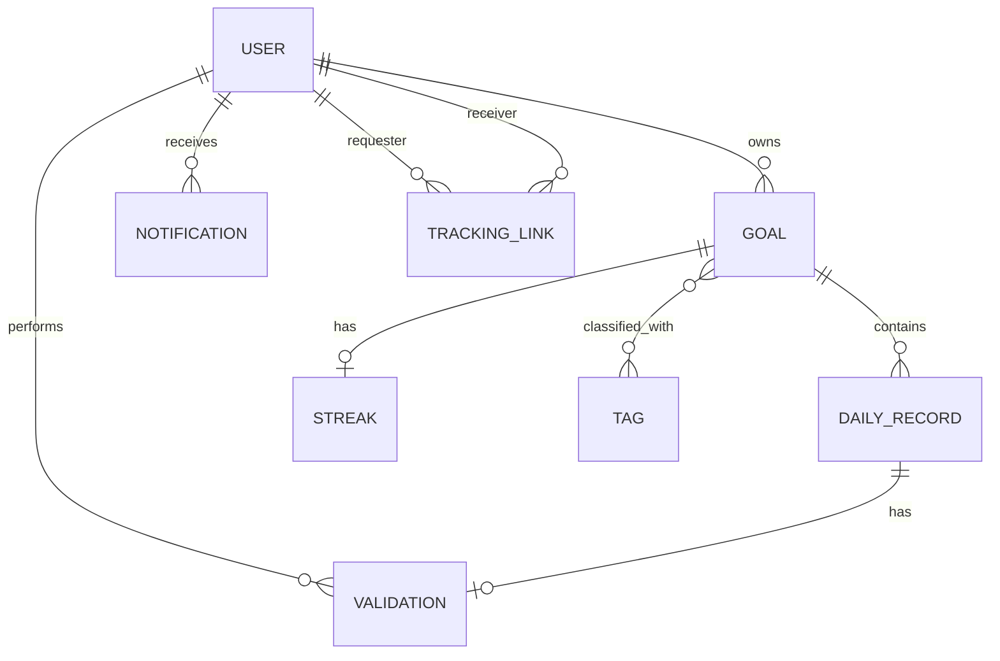
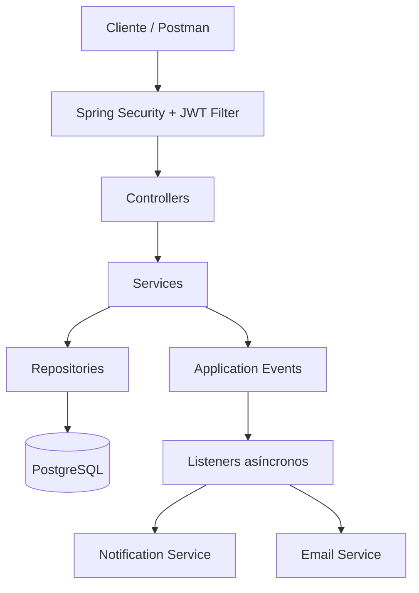
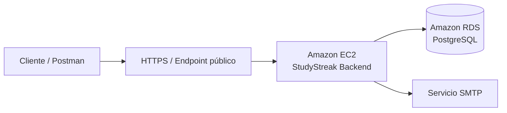

# StudyStreak — Seguimiento colaborativo de hábitos de estudio

Backend desarrollado para el curso **CS 2031 – Desarrollo Basado en Plataforma**.

## Portada

**Título del proyecto:** StudyStreak — Seguimiento colaborativo de hábitos de estudio  
**Curso:** CS 2031 Desarrollo Basado en Plataforma

**Integrantes:**

- [Fabricio Nick Tumialan Maihua](mailto:fabricio.tumialan@utec.edu.pe) — **202520045**
- [Leonard Alexander Landeo Huatay](mailto:leonardo.landeo@utec.edu.pe) — **202520151**
- [Jared Eloy Daniel Chala Lastra](mailto:jared.chala@utec.edu.pe) — **202520040**

**Backend desplegado:** `Pendiente`

---

## Índice

1. [Introducción](#introducción)
2. [Identificación del problema o necesidad](#identificación-del-problema-o-necesidad)
3. [Descripción de la solución](#descripción-de-la-solución)
4. [Tecnologías utilizadas](#tecnologías-utilizadas)
5. [Modelo de entidades](#modelo-de-entidades)
6. [Manejo de errores](#manejo-de-errores)
7. [Medidas de seguridad implementadas](#medidas-de-seguridad-implementadas)
8. [Eventos y asincronía](#eventos-y-asincronía)
9. [Endpoints principales](#endpoints-principales)
10. [Ejecución local](#ejecución-local)
11. [Docker y PostgreSQL](#docker-y-postgresql)
12. [Despliegue en AWS](#despliegue-en-aws)
13. [GitHub & Management](#github--management)
14. [Conclusión](#conclusión)
15. [Apéndices](#apéndices)

---

## Introducción

### Contexto

StudyStreak es una aplicación backend orientada a ayudar a estudiantes a mantener hábitos de estudio constantes. Integra metas personales, registro de progreso diario, seguimiento entre usuarios, validación de actividades, cálculo de rachas, notificaciones y autenticación segura dentro de una API REST.

El proyecto fue desarrollado con Spring Boot y PostgreSQL siguiendo una arquitectura por capas. Spring Security y JWT protegen los recursos privados, mientras que eventos de aplicación y listeners asíncronos desacoplan tareas secundarias como notificaciones y correo electrónico.

### Objetivos del proyecto

El objetivo general es desarrollar un backend seguro y estructurado para gestionar metas de estudio y convertir el progreso diario en información verificable. Los objetivos específicos son permitir registro y login, proteger contraseñas con BCrypt, administrar metas y registros diarios, organizar metas mediante tags, gestionar relaciones de seguimiento, validar progreso, calcular rachas, generar notificaciones, integrar correo, persistir información en PostgreSQL y facilitar ejecución con Docker y despliegue en AWS.

---

## Identificación del problema o necesidad

### Descripción del problema

Muchos estudiantes definen metas académicas, pero tienen dificultades para mantener constancia. El progreso suele registrarse de forma informal y no siempre existe una forma clara de visualizar continuidad, comprobar avances o compartir responsabilidad con otra persona.

StudyStreak aborda este problema mediante metas, registros diarios y relaciones de seguimiento. Los registros pueden ser validados por usuarios autorizados y utilizarse para calcular una racha que representa la continuidad del hábito.

### Justificación

La constancia es un componente importante de los hábitos de estudio. StudyStreak convierte el progreso diario en información estructurada y verificable y agrega un componente de responsabilidad compartida. Técnicamente, el proyecto permite aplicar persistencia relacional, DTOs, APIs REST, seguridad, eventos, asincronía, contenedores y despliegue en la nube.

---

## Descripción de la solución

El flujo principal es:

```text
Registro → Login → JWT → Goal → DailyRecord → TrackingLink
→ Validation → Streak → Notifications
```

Los controllers reciben las peticiones y delegan en services. Los services aplican reglas de negocio, ownership y transacciones. Los repositories administran PostgreSQL mediante Spring Data JPA y los DTOs separan el contrato externo de las entidades persistentes.

### Funcionalidades implementadas

- **Usuarios y autenticación:** registro, login, access token y refresh token.
- **Goals:** creación, consulta, actualización y eliminación de metas.
- **DailyRecords:** progreso diario con restricción de duplicados por meta y fecha.
- **Tags:** clasificación de metas mediante relación muchos a muchos.
- **TrackingLinks:** seguimiento entre usuarios con estados `PENDING`, `ACCEPTED` y `REJECTED`.
- **Validations:** aprobación o rechazo de registros por usuarios autorizados.
- **Streaks:** cálculo de racha actual y mejor racha.
- **Notifications:** avisos generados a partir de eventos del dominio.

---

## Tecnologías utilizadas

- Java 21 y Maven
- Spring Boot 4.1.1 y Spring Web
- Spring Data JPA / Hibernate
- Spring Security y JJWT
- Jakarta Bean Validation
- PostgreSQL 17
- ModelMapper y Lombok
- Spring Mail / JavaMailSender y servicio SMTP
- Docker y Docker Compose
- AWS EC2 y Amazon RDS for PostgreSQL
- Git y GitHub

---

## Modelo de entidades

Las entidades persistentes principales son **User, Goal, DailyRecord, Tag, TrackingLink, Validation, Streak** y **Notification**.

### Diagrama Entidad-Relación



### Descripción de entidades

| Entidad | Atributos principales | Relaciones |
|---|---|---|
| `User` | `id`, `username`, `email`, `password`, `active`, `registrationDate`, `timeZone`, `role` | Posee Goals, recibe Notifications y participa en TrackingLinks y Validations |
| `Goal` | `id`, `topic`, `frequency`, `duration`, `completed` | Pertenece a User, contiene DailyRecords, Tags y puede tener Streak |
| `DailyRecord` | `id`, `date`, `note`, `evidence` | Pertenece a Goal y puede tener Validation |
| `Tag` | `id`, `name` | Relación muchos a muchos con Goal |
| `TrackingLink` | `id`, `requester`, `receiver`, `status` | Relaciona dos Users |
| `Validation` | `id`, `approved`, `comment` | Pertenece a DailyRecord y es realizada por User |
| `Streak` | `id`, `currentStreak`, `bestStreak`, `lastUpdateDate` | Pertenece a Goal |
| `Notification` | `id`, `message`, `read`, `createdAt`, `type` | Pertenece a User |

Existen restricciones para username y email únicos, un DailyRecord por meta y fecha, un Streak por Goal y una Validation por DailyRecord.

### Arquitectura general



---

## Manejo de errores

El backend centraliza excepciones mediante `@RestControllerAdvice`. El formato común es:

```json
{
  "timestamp": "2026-09-25T00:00:00Z",
  "status": 400,
  "error": "Bad Request",
  "message": "Descripción del error",
  "path": "/ruta"
}
```

Se manejan `400 Bad Request`, `401 Unauthorized`, `403 Forbidden`, `404 Not Found`, `409 Conflict` y `500 Internal Server Error`. Además de `ResourceNotFoundException`, `ConflictException` y `ForbiddenException`, el handler procesa `BadCredentialsException`, `MethodArgumentNotValidException`, `HttpMessageNotReadableException`, `IllegalArgumentException` y errores inesperados. Spring Security utiliza el mismo `ErrorResponseDTO` para respuestas 401 y 403.

El registro comprueba username y email duplicados antes de persistirlos, por lo que dichos conflictos se transforman en `409 Conflict` en lugar de errores internos.

---

## Medidas de seguridad implementadas

### Autenticación y autorización

Las contraseñas se almacenan con `BCryptPasswordEncoder`. El registro valida username, email, zona horaria y una contraseña de 8 a 72 caracteres que debe contener mayúscula, minúscula y número.

`POST /login` devuelve un **access token** y un **refresh token**. Ambos JWT incluyen `userId`, `email`, `role` y un claim `type`; el access token usa `type=access` y el refresh token `type=refresh`. `POST /refresh` valida el refresh token y emite un nuevo par de tokens. La firma y los tiempos de expiración se configuran mediante variables de entorno.

`JwtRequestFilter` valida el Bearer Token, comprueba que sea de tipo access, verifica su expiración y rol y establece la identidad en `SecurityContext`. Los services aplican ownership para impedir acceso a recursos ajenos.

La aplicación define roles `USER` y `ADMIN`. `@EnableMethodSecurity` habilita seguridad por método; `DELETE /users/{userId}` y `POST /api/goals/{goalId}/streak/recalculate` están restringidos con `@PreAuthorize("hasRole('ADMIN')")`.

### Prevención de vulnerabilidades

- **Inyección SQL:** acceso mediante Spring Data JPA y consultas parametrizadas.
- **CSRF:** deshabilitado porque la API es stateless y usa Bearer Token.
- **XSS:** el backend responde principalmente JSON y no renderiza HTML con entrada del usuario.
- **CORS:** permite orígenes locales `http://localhost:*` y métodos HTTP configurados.
- **Secretos:** JWT, base de datos y SMTP se suministran mediante variables de entorno y `.env` no debe versionarse.

---

## Eventos y asincronía

La aplicación publica eventos para desacoplar procesos secundarios. Existen casos para registro de usuario, finalización de meta, solicitud de TrackingLink, respuesta a la invitación y finalización de la relación de seguimiento.

Los listeners usan `@TransactionalEventListener(phase = AFTER_COMMIT)` para reaccionar únicamente después de una transacción exitosa. La asincronía se habilita mediante `@EnableAsync` y `ThreadPoolTaskExecutor`, evitando que tareas como correo y notificaciones bloqueen la respuesta HTTP principal.

El servicio de correo usa `JavaMailSender`; después del registro, un listener asíncrono envía un correo de bienvenida usando configuración SMTP externa.

---

## Endpoints principales

| Dominio | Endpoints principales |
|---|---|
| Autenticación | `POST /register`, `POST /login`, `POST /refresh` |
| Usuarios | `GET/PATCH /users/{userId}`, `DELETE /users/{userId}` *(ADMIN)* |
| Goals | `GET/POST /users/{userId}/goals`, `GET/PUT/DELETE /users/{userId}/goals/{goalId}` |
| Tags | `GET/POST /users/{userId}/goals/{goalId}/tags`, `GET/PATCH/DELETE .../{tagId}` |
| DailyRecords | `GET/POST /api/goals/{goalId}/daily-records`, `GET/PUT/DELETE .../{dailyRecordId}` |
| TrackingLinks | `POST /api/tracking-links/{receiverId}`, `GET /api/tracking-links`, `/pending`, `/active`, `/with/{otherUserId}`, `PATCH .../{trackingId}/status`, `DELETE .../{trackingId}` |
| Validations | `POST/GET/PUT /api/goals/{goalId}/daily-records/{dailyRecordId}/validation` |
| Streak | `GET /api/goals/{goalId}/streak`, `POST .../recalculate` *(ADMIN)* |
| Notifications | `GET /users/{userId}/notifications`, `/unread`, `/type/{type}`, `PATCH .../{notificationId}/read`, `DELETE .../{notificationId}` |

Los endpoints protegidos requieren `Authorization: Bearer <access-token>`. Los listados que reciben `Pageable` soportan paginación.

---

## Ejecución local

Requisitos: Java 21, Git, Docker y Docker Compose.

```bash
git clone <REPOSITORY_URL>
cd StudyStreak
cp .env.example .env
```

Variables principales: `POSTGRES_DB`, `POSTGRES_USER`, `POSTGRES_PASSWORD`, `POSTGRES_PORT`, `APP_PORT`, `JWT_SECRET`, `JWT_EXPIRATION`, `JWT_REFRESH_EXPIRATION`, `MAIL_HOST`, `MAIL_PORT`, `MAIL_USERNAME` y `MAIL_PASSWORD`. Al ejecutar Spring fuera de Docker también pueden definirse `SPRING_DATASOURCE_URL`, `SPRING_DATASOURCE_USERNAME` y `SPRING_DATASOURCE_PASSWORD`.

```bash
set -a
source .env
set +a
./mvnw spring-boot:run
```

Las pruebas automatizadas se ejecutan con:

```bash
./mvnw clean test
```

La versión revisada contiene **8 tests** que cubren carga del contexto, JWT access/refresh, separación entre refresh y access token, ownership de DailyRecords y respuestas 403/404/409 del manejador global.

---

## Docker y PostgreSQL

Docker Compose levanta PostgreSQL 17 y el backend. La aplicación recibe por variables de entorno la URL JDBC, credenciales, configuración JWT —incluida la expiración del refresh token— y configuración SMTP. PostgreSQL utiliza un volumen persistente.

```bash
docker compose up --build
```

---

## Despliegue en AWS

La arquitectura prevista utiliza **Amazon EC2** para el backend y **Amazon RDS for PostgreSQL** para persistencia.



Los valores sensibles se proporcionan mediante variables de entorno y los Security Groups controlan el acceso entre cliente, EC2 y RDS.

**URL pública:** `[AWS_BACKEND_URL]`

---

## GitHub & Management

El trabajo se organizó mediante **GitHub Issues**, ramas por tarea y Pull Requests. Los issues fueron asignados a integrantes y cada cambio se implementó en una rama independiente antes de revisión y merge a `main`.

```text
Issue → responsable → rama → implementación y pruebas → commit/push
→ Pull Request → revisión → merge a main
```

La verificación final del backend incluyó pruebas Maven, construcción de imagen Docker, revisión de Docker Compose y pruebas funcionales del flujo registro → login → Goal → DailyRecord → TrackingLink → Validation → Streak.

### GitHub Actions

La versión revisada del repositorio no contiene workflows en `.github/workflows`, por lo que no se afirma que exista CI automatizado con GitHub Actions. El flujo utilizado se basa en validación local y Pull Requests.

---

## Conclusión

### Logros del proyecto

StudyStreak integra autenticación y autorización, persistencia, metas, progreso diario, seguimiento entre usuarios, validaciones, rachas, notificaciones, correo y asincronía. La solución permite registrar continuidad y compartir seguimiento dentro de una API segura.

### Aprendizajes clave

El proyecto permitió aplicar modelado relacional, JPA, DTOs, arquitectura por capas, JWT con access/refresh tokens, ownership, manejo global de errores, eventos transaccionales, asincronía, PostgreSQL, Docker, AWS y trabajo colaborativo con GitHub.

### Trabajo futuro

Como mejoras se propone desarrollar un frontend, ampliar estadísticas, agregar recordatorios, aumentar cobertura de pruebas, añadir Swagger/OpenAPI, incorporar logging estructurado, automatizar CI/CD y mejorar las plantillas de correo.

---

## Apéndices

### Licencia

Este proyecto se distribuye bajo la licencia MIT.

### Referencias

- Documentación oficial de Spring Boot, Spring Security y Spring Data JPA
- Documentación oficial de PostgreSQL y Docker
- Documentación de Jakarta Bean Validation y JJWT
- Documentación de Amazon EC2 y Amazon RDS
